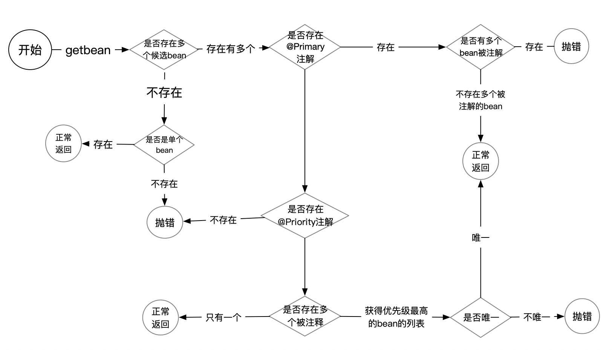

# Spring 多个候选bean时如何匹配

最近项目里面大量用到@Primary注解,但我们经常会遇到一些需求就是我继承一个类,然后覆写了其中的某些方法,然后就在上面加上了@Primary 注解.然而在某些场景下,我还要继承这个类来覆写其他的特定逻辑.导致多个@Primary注解的出现.我就思考有没有一个能表示依赖注入优先级的注解.后来查看注解之后,果然有一个注解可以用,那就是@Priority注解.接下来几个demo详细讲解这个注解的使用.

spring 的依赖注入和getBean(class)的时候(getBean(string)不存在这个问题,spring 容器中id是唯一的),会查找最合适的bean来处理.如果存在多个bean的时候,会抛NoUniqueBeanDefinitionException.

验证代码.
```java
public interface HelloService {
    String sayHello();
}

@Service
@Primary
public class HelloServiceImpl implements HelloService {
    @Override
    public String sayHello() {
        return "I'm no priority";
    }
}

@Service
@Priority(1)
public class HelloServiceImpl1 implements HelloService {
    @Override
    public String sayHello() {
        return "I'm priority 1";
    }
}

@Priority(2)
@Service
public class HelloServiceImpl2 implements HelloService {
    @Override
    public String sayHello() {
        return "I'm priority 2";
    }
}

@Configuration
@ComponentScan
public class HelloConfigration {
}

public class Client {
    public static void main(String[] args) {
        ApplicationContext applicationContext = new AnnotationConfigApplicationContext(HelloConfigration.class);
        HelloService helloService = applicationContext.getBean(HelloService.class);
        System.out.println(helloService.sayHello());
    }
}
```

我们分六个case验证这几个注解和不加时的默认优先级问题(默认都加@Service注解).
- case1: HelloService的三个实现类都不加@Primary和@Priority注解.
- case2: HelloService的三个实现类中,HelloServiceImpl加@Primary注解,其他不加
- case3: HelloService的三个实现类中,HelloServiceImpl和HelloServiceImpl1都加@Primary注解,
- case4: HelloService的三个实现类中,HelloServiceImpl1和HelloServiceImpl2加@Priority注解,但里面设置的优先级不同.
- case5: HelloService的三个实现类中,HelloServiceImpl1和HelloServiceImpl2加@Priority注解,但里面设置的优先级相同.
- case6: HelloService的三个实现类中,HelloServiceImpl1和HelloServiceImpl2加@Priority注解,但里面设置的优先级不同.且HelloServiceImpl加@Primary注解

测试结果如下:
1. case1:抛错,提示三个候选bean,NoUniqueBeanDefinitionException: No qualifying bean of type 'spring.priority.HelloService' available: expected single matching bean but found 3
1. case2:正常输出:I'm no priority
1. case3:抛错,提示存在多个@Primary注解的bean实例,NoUniqueBeanDefinitionException: No qualifying bean of type 'spring.priority.HelloService' available: more than one 'primary' bean found among candidates
1. case4:正常输出:I'm priority 1
1. case5:抛错,存在多个优先级是1的实例:NoUniqueBeanDefinitionException: No qualifying bean of type 'spring.priority.HelloService' available: Multiple beans found with the same priority ('1') among candidates
1. case6:正常输出,I'm no priority

主要判断流程如下图所示:


以上就是多个候选bean时spring的判断逻辑.